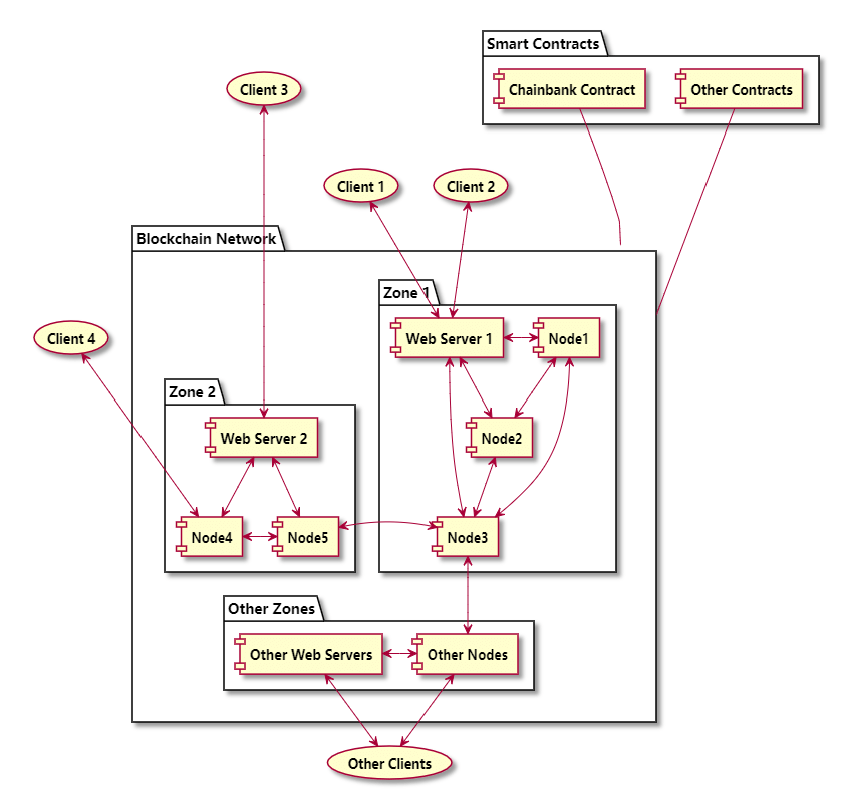
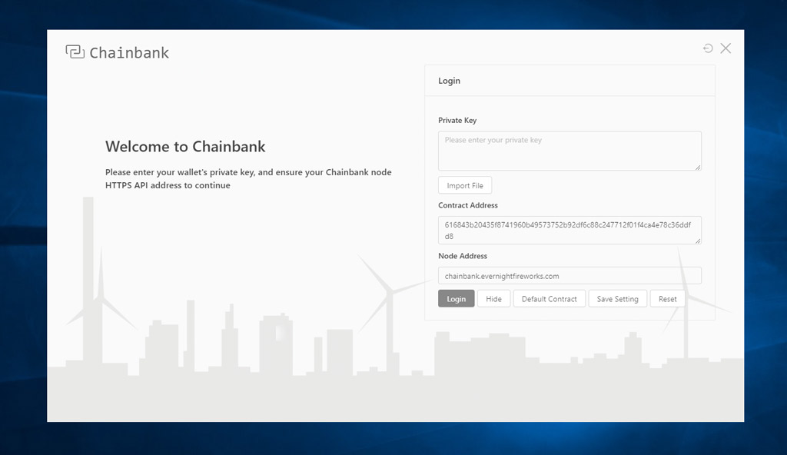
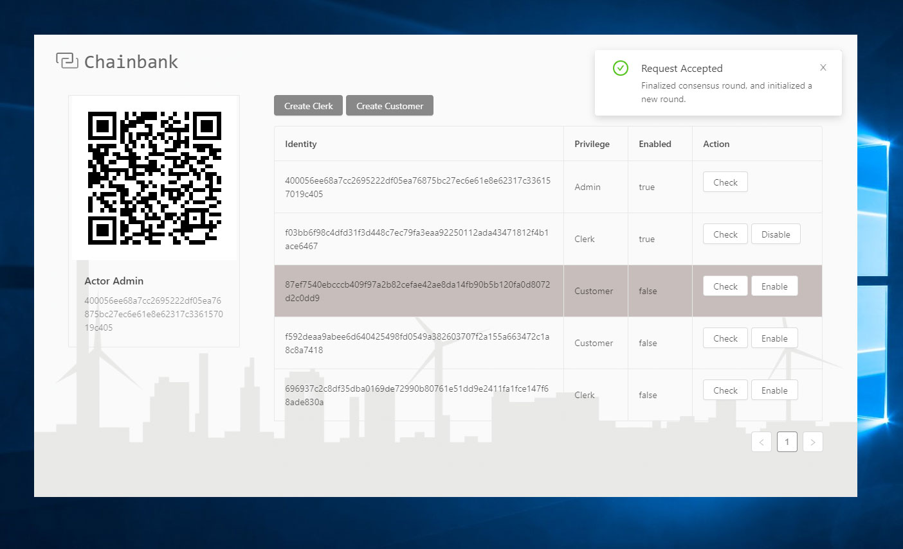
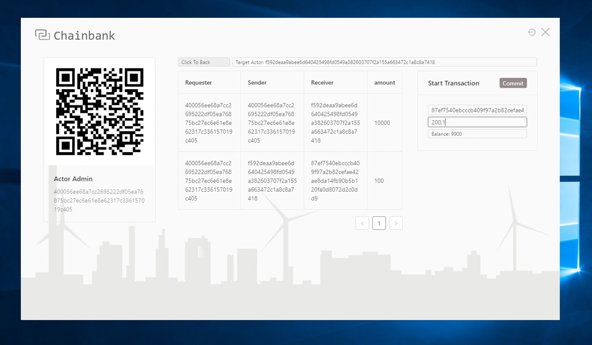
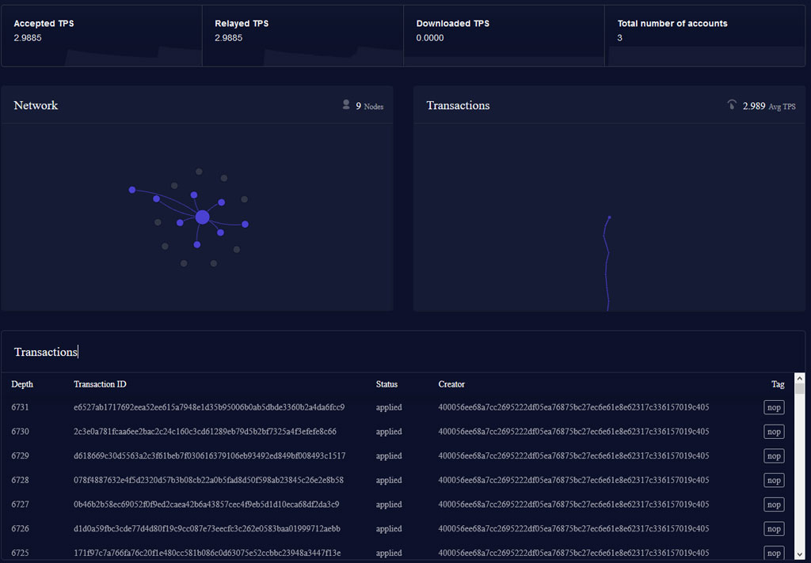

<h1 align="center">
    <br>
    Chainbank
</h1>
<p align="center">
    <b>
    A tiny bank demo based on lens blockchain.
    Project of course comp-3026, 2019 fall, hitsz. 
    </b>
</p>

<p align="center">


  
  
  
</p>


---

## 📑 Course Task: Web-based Banking System

**deadline: 11 November (Monday) 2019**

You are to design and implement a Web-based Banking System by using the Java Applet and Servlet technology. 

The system consists of three components: a Java applet as the client, a Java servlet and a DBMS system. The servlet receives requests from the applet, accesses the DBMS system via JDBC, and sends replies back to the applet. The DBMS is a MySql system which installed in the server you create. 

The client program is basically a graphical interface. It displays a list of buttons for users to select operations. There are four operations: 

- accnt_num = open_account(user_name); 
- delete_account(accnt_num); 
- bal = balance(accnt_num);
- transfer(source_accnt, dest_accnt, amnt).

There are two types of users of the system: customers and bank-clerks. Only bank clerks have authority to open or delete accounts (customers can only use “balance” or “transfer” operations). You need to use programming security method for authentication and access control. The security measure should have session tracking ability for logged in users. That is, a user will not be asked to login again if he/she already logged in during the same session. There is no need to use “SSL”.

For unspecified design and implementation details (particularly data structures, interface design), make your own reasonable decisions. You need to demonstrate your system on the due date at demonstration time. 
You must hand in the following documents at your demonstration time:
1.	a copy of design document (2 pages maximum), stating the system structure, design, and implementation. It should also include your names (or student IDs) and the URL of your system;
2.	A hard copy (no CD) of full program list (client and server).
Your assignment will be assessed on the following criteria:
    - documentation (20%)
    - interface design (20%)
    - implementation (source code) and programming styles (60%)

A system which is not working will have no more than 50% of the total mark; and a system which works properly (with minimum required functionality) will have at least 50% of the total mark. The system design could base on the programming language you prefer.

## 🔧 System Structure

### Structure Elements

- Blockchain network: It has at least three nodes, and one to many network zones.
- Smart contract: A WebAssembly based smart contract running on the chain.
- Clients: Web or electron based cross-platform clients.
- Web Servers: Web server(s) which provide reverse proxy, load balancing, https services and etc if needed.

### Structure Diagram



## 📙 System Design

### Why Blockchain?

- **Scalable**
- **Practical**
- **Succinct**
- **Secure**

### Contract API Design

The chainbank contract is a smart contract based on blockchain, which has serveral bank agreements.

```rust
#[smart_contract_macro]
impl Bank {
    // ...
}
```

All initalizing logic should be placed into `init` function. Here we will enable all root users, or admins. And inserts them into actors map.

```rust
pub fn init(_params: &mut Parameters) -> Self { /* */ }
```

The `enable_clerk`, `disable_clerk`, `enable_customer`, `disable_customer` are used to satisfy `open_account` and `delete_account` requirements. The params contain requirement requster to auth and target to enable or disable.

Only admins can enable or disable clerks, while admins and clerks can enable or disable customers.And because any transactions will saves on the chain forever, no actor can be 'deleted' while they can be 'disable'. 

```rust
pub fn enable_clerk(&mut self, params: &mut Parameters) -> Result<(), String> { /* */ }
pub fn disable_clerk(&mut self, params: &mut Parameters) -> Result<(), String> { /* */ }
pub fn enable_customer(&mut self, params: &mut Parameters) -> Result<(), String> { /* */ }
pub fn disable_customer(&mut self, params: &mut Parameters) -> Result<(), String> { /* */ }
```

The `transfer` params contain requester, sender, receiver and amount. For the requester:

- When the requester is a customer, he or she can only transfer from himself or herself to others.
- When a admin or a clerk, can transfer from anyone to others to manage accounts.

And for sure, the amount should be lower than or equal to your balance.

```rust
pub fn transfer(&mut self, params: &mut Parameters) -> Result<(), String> { /* */ }
```

The `get_transactions` params contain requester, target. Similarly, only admins and clerks can get transactions of all actors, while customers can just get their own. The function will log init balance of target and all transaction records. 

```rust
pub fn get_transactions(&mut self, params: &mut Parameters) -> Result<(), String> { /* */ }
```

Only admins or clerks can call the `get_actors` function. It logs all actors' information and status.

```rust
pub fn get_actors(&mut self, params: &mut Parameters) -> Result<(), String> { /* */ }
```

Anyone can use `get_actor` to get their own status. And as the side effects, you can verify your private key with it to log in.

```rust
pub fn get_actor(&mut self, params: &mut Parameters) -> Result<(), String> { /* */ }
```

## 💻 System Implements

### Client Implements

I choose [Electron](https://electronjs.org/) to implement the client, because you can use all web development resources and tool stack with it, and easily build cross-platform apps. [Angular](https://angular.io/) is the front-end framework selection, and [NG-ZORRO](https://ng.ant.design/) is the components library. For more details, you can view client source code at `./bank-client` folder, can you can find binary release at github `release` page.

#### The login page

At login page, you can enter your private key or click `Import File` to load it from a text file to login. Click `Default Contract`, will load default contract address from your api address with `https://hostname/default_contract`. You can also use `Save Settings` and `Reset` them to default version.



#### The clerk manage console

At clerk manage console, you can view all actors infomation, enable or disable actor with their public key. Use `Check`, can get more details and edit a actor.



#### The customer console

At customer console, you can `Commit` a transaction, view all history transactions and get current balance.



### Contract Implements

I implement contract with [Rust](https://www.rust-lang.org/) language, build it to [WebAssembly](https://webassembly.org/) binary using the following command on `./bank-contract` folder. 

```bash
cargo +nightly build --target wasm32-unknown-unknown --release
```

And you should deploy the binary file to the chain, using the following command at any nodes:

```bash
# spawn <path-to-contract>/<contract-name>.wasm <gas-limit-amount>
spawn contract/contract.wasm 100000
# g <contract-address> <deposit-gas-amount>
g 616843b20435f8741960b49573752b92df6c88c247712f01f4ca4e78c36ddfd8 300000
```

API of the contract has been stated in `contract api design` section. There are other function tools and strutures on the following:

`Privilege` describes a actor's privilege.

```rust
#[allow(dead_code)]
#[derive(Debug)]
enum Privilege {
    Admin = 0,
    Clerk = 1,
    Customer = 2,
}
```

`Actor` descibe a actor. And when `enabled` is `false` or actor doesn't exist at `actors` map, you can not commit any request.

```rust
#[derive(Debug)]
struct Actor {
    privilege: Privilege,
    identity: [u8; 32],
    enabled: bool,
}
```

`Transaction` is a atomic transfer record, whose `requester` can be a admin or clerk, or `sender` he or she self.

```rust
#[derive(Debug)]
struct Transaction {
    requester: [u8; 32],
    sender: [u8; 32],
    receiver: [u8; 32],
    amount: Decimal,
}

#[derive(Debug)]
struct TransferRequest {
    sender: [u8; 32],
    receiver: [u8; 32],
    amount: Decimal,
}
```

`Bank` stores the actors and transactions on the chain.

```rust
struct Bank {
    actors: HashMap<[u8; 32], Actor>,
    transactions: VecDeque<Transaction>,
}
```

`Bankutil` provides function utilities for the bank contract.

```rust
impl BankUtil {
    fn validate_clerk_editor(_bank: &Bank, requester_actor: &Actor) 
        -> Result<(), String> { /**/ }
    fn validate_customer_editor(_bank: &Bank, requester_actor: &Actor) 
        -> Result<(), String> { /**/ }
    fn validate_requester<'a>(bank: &'a Bank, params: &Parameters)
        -> Result<&'a Actor, String>{ /**/ }
    fn get_actor<'a>(bank: &'a Bank, identity: &[u8; 32])
        -> Result<&'a Actor, String> { /**/ }
    fn balance(bank: &Bank, actor: &Actor) -> Decimal { /**/ }
    fn actor_init_amount(privilege: &Privilege) -> Decimal { /**/ }
}
```

### Web Server Implements

I choose [Nginx](https://www.nginx.com/) as the web server of my zone, providing reverse proxy, load balancing and https services. There is a nginx vhost example at `./wavelet-config/nginx/chainbank.conf`. You can use others as well.

### Blockchain Implements

I choose [Wavelet](https://wavelet.perlin.net/) as the node driver and my own network as the host chain. The wavelet is an open ledger for writing scalable, mission-critical, decentralized WebAssembly applications.

There are some config files for chain nodes:

- example wallet files: at `./wavelet-config/wallet`
- node config generation seed: at `./wavelet-config/script/.wavelet_rc.sh`
- node config generation script: at `./wavelet-config/script/gen_nodes.sh`
- node daemon script: at `./wavelet-config/script/daemon_nodes.sh`

My own network dashboard using [Lens](https://lens.perlin.net):



## 🏷️ Attention & Fix: 

- `wavelet v0.2.0` has severe bugs, whose syncing function always not works, please use `v0.1.1`.
- In angular, `import 'zone.js/dist/zone'`(in `polyfills.ts`) must be import after `import 'app.module'`
- There are `zone.js` bugs when using building production, please use build dev.