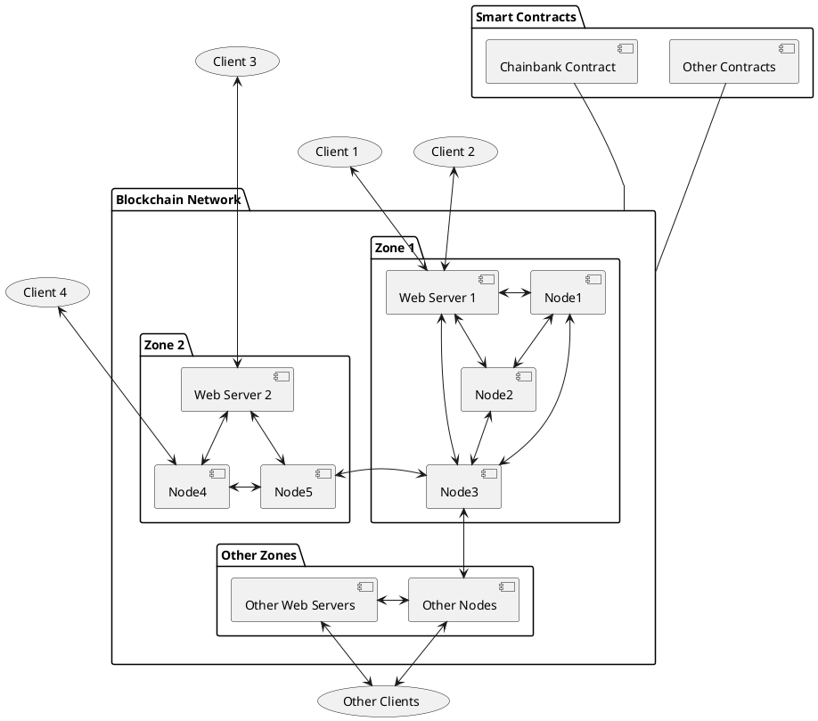

```puml
@startuml
top to bottom direction

package "Smart Contracts" {
    [Other Contracts]
    [Chainbank Contract]
}

[Chainbank Contract] --- [Blockchain Network]
[Other Contracts] --- [Blockchain Network]

package "Blockchain Network" {
    package "Zone 1" {
        [Node1] <-> [Node2]
        [Node2] <-> [Node3]
        [Node1] <--> [Node3]
        [Web Server 1] <-> [Node1]
        [Web Server 1] <--> [Node2]
        [Web Server 1] <---> [Node3]
    }
    package "Zone 2" {
        [Web Server 2] <--> [Node4]
        [Web Server 2] <--> [Node5]
        [Node4] <-> [Node5]
    }
    package "Other Zones" {
        [Other Web Servers] <-> [Other Nodes]
    }
    [Node3] <-> [Node5]
    [Node3] <--> [Other Nodes]
}

(Client 1) <--> [Web Server 1]
(Client 2) <--> [Web Server 1]
(Client 3) <----> [Web Server 2]
(Client 4) <---> [Node4]
[Other Nodes] <--> (Other Clients)
[Other Web Servers] <--> (Other Clients)

@enduml
```